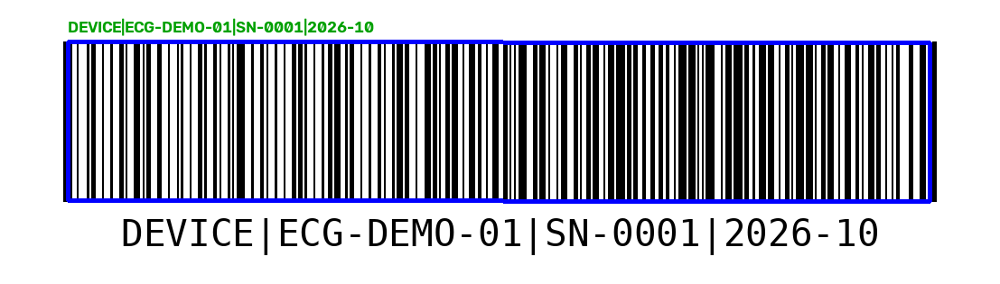

# Сканер QR-кодов и штрихкодов (Code128)

Генерация и распознавание кодов, которые используются для маркировки изделий и учёта: QR и Code128. Найденные коды обводятся на изображении вместе с расшифровкой.



## Использование

```bash
# Linux: sudo apt-get install libzbar0
python -m codescan gen-code128 "DEVICE|ECG-DEMO-01|SN-0001" out.png
python -m codescan gen-qr "DEVICE|ECG-DEMO-01|SN-0001" qr.png
python -m codescan scan out.png --annotate out_scanned.png
```

```python
from codescan import make_qr, scan_image
path = make_qr("hello", "q.png")
print([(r.kind, r.data) for r in scan_image(path)])
```

Демо: `python examples/demo.py`. Тесты: `pytest`.

## Что изменено по сравнению с учебным ноутбуком

- Из ноутбука с `!apt-get` и `!pip` сделан пакет с CLI.
- Для QR добавлен запасной детектор OpenCV, если pyzbar или системная libzbar недоступны.
- Проверки: пустые данные, не-ASCII для Code128 (кириллицу нужно транслитерировать), отсутствующий файл.
- Подпись над кодом больше не обрезается.
- 7 тестов: круговая проверка «создать → прочитать» для QR и Code128, запасной детектор, пустое изображение.
- В исходном ноутбуке в код «зашивались» имя и ID пациента. Здесь пример с вымышленной записью об изделии: реальные персональные данные в коды класть не нужно.

## Ограничения

Читаются чёткие синтетические изображения. Работа с фотографиями (наклон, блики, размытие) в тестах не проверялась.
