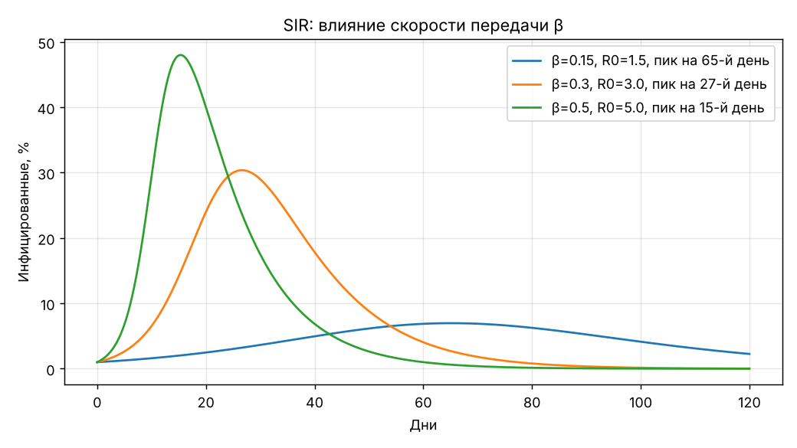
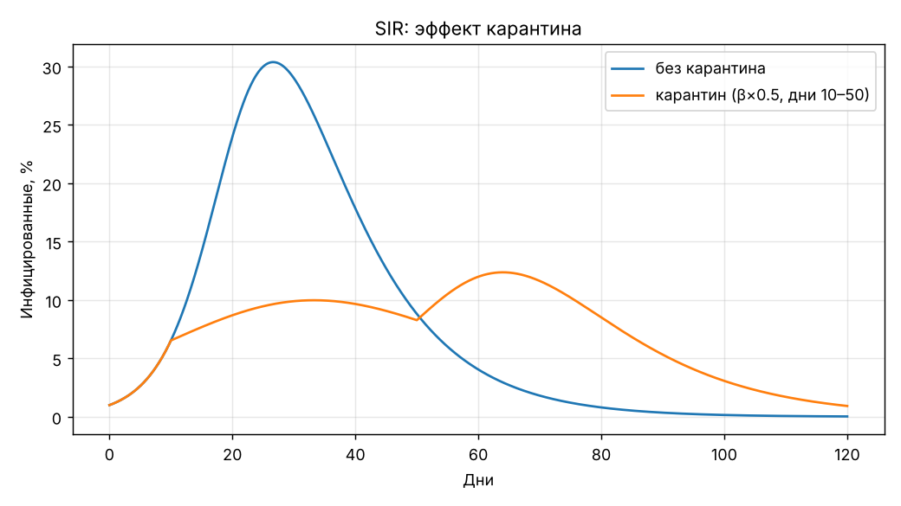
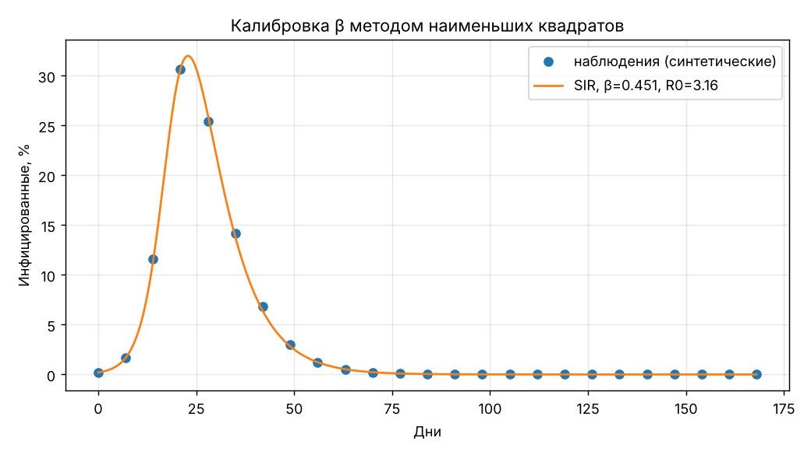
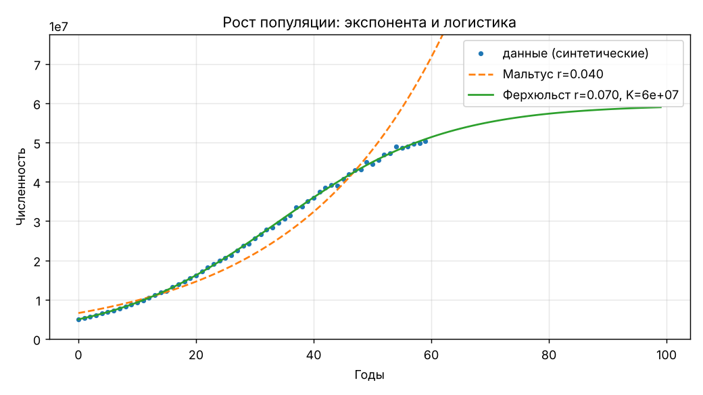

# Модели биосистем: SIR и рост популяции

- **SIR** в долях населения (S + I + R = 1) с постоянным или зависящим от времени β (карантин), расчётом R₀, пика и итогового размера эпидемии.
- **Калибровка β**: по дню пика (быстро, но грубо) и по всему ряду наблюдений методом наименьших квадратов (устойчивее).
- **Мальтус** (экспонента, время удвоения, регрессия по ln N) и **Ферхюльст** (логистика, подбор N₀, r, K нелинейным МНК).

| β и R₀ | Карантин | Калибровка по ряду |
|---|---|---|
|  |  |  |



## Использование

```python
from epimodels import simulate_sir, peak, basic_r0, fit_beta_to_series

res = simulate_sir(beta=0.3, gamma=0.1, i0=0.01, days=120)
print(basic_r0(0.3, 0.1), peak(res))          # R0 = 3.0, (день пика, доля)
quarantine = lambda t: 0.15 if 10 <= t <= 50 else 0.3
res_q = simulate_sir(quarantine, 0.1, 0.01, 120)
```

Демо: `python examples/demo.py`. Тесты: `pytest`.

## Что изменено по сравнению с учебным ноутбуком

- **Исправлена нормировка.** В исходном коде скорость заражения считалась по числу людей без деления на N, поэтому формальное R₀ = β/γ не соответствовало динамике. Теперь модель в долях, R₀ = β/γ.
- Эйлер для сценария с карантином заменён на `solve_ivp`.
- Подбор β по дню пика (целочисленный argmax) заменён на более устойчивую калибровку по всему ряду. На синтетических данных с шумом 5% истинное β = 0,45, по ряду получено 0,451, по одному дню пика — 0,485. Это показывает, почему одной точки мало.
- Ферхюльст: параметр r подбирается, а не задаётся вручную.
- 13 тестов, среди них: сохранение населения, отсутствие эпидемии при R₀ < 1, совпадение итогового размера с теоретическим уравнением z = 1 − e^(−R₀z), восстановление известных параметров.

## Ограничения

Демо работает на синтетических данных. Модель простая (без инкубации, возрастных групп, вакцинации); результаты не прогноз.
