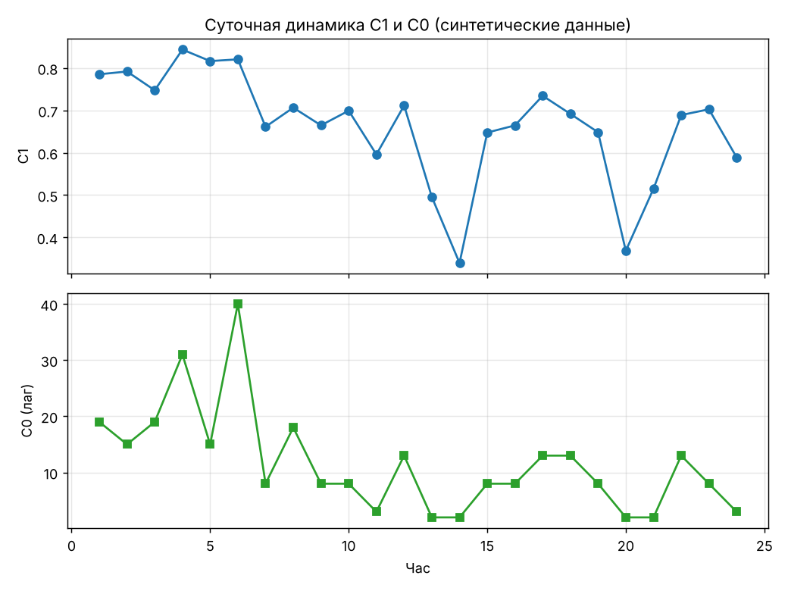
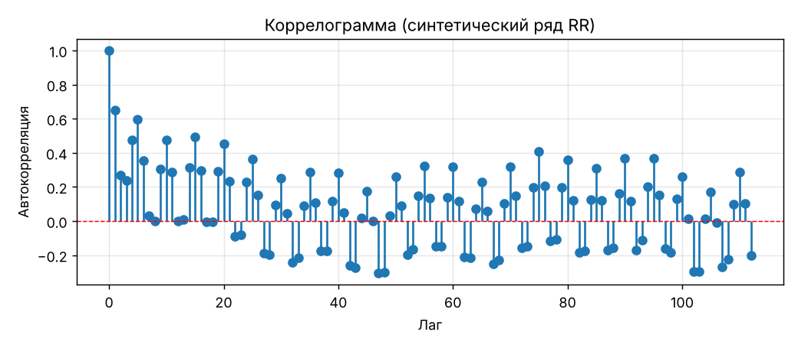

# Автокорреляционный анализ ритма сердца

Расчёт автокорреляционной функции (ACF) ряда RR-интервалов и двух показателей:

- **C1** — автокорреляция при лаге 1 (насколько соседние интервалы похожи; высокие значения соответствуют медленным волнам);
- **C0** — номер первого лага, где автокорреляция становится отрицательной.

Есть суточный режим: ряд делится по часам, для каждого часа считаются C1, C0 и словесная оценка C1.




## Использование

```python
from hrv_acf import autocorrelation, c1_c0, analyze_hours, synthetic_rr

rr = synthetic_rr(n=450, slow_wave=0.05, seed=1)   # RR в секундах
acf = autocorrelation(rr)                           # лаги 0..n//4
c1, c0 = c1_c0(rr)
```

Из командной строки (CSV с колонками `hour`, `rr`):

```bash
python -m hrv_acf.cli my_data.csv --rr-col rr
```

Демо с графиками: `python examples/demo.py`. Тесты: `pytest`.

## Что изменено по сравнению с учебным ноутбуком

- Код вынесен из ноутбука в пакет, добавлены docstring и 12 тестов (белый шум, AR(1) с известным φ, синус с известным периодом, постоянный ряд, NaN, короткие ряды).
- Две реализации автокорреляции (`pearson` — как в методичке, `standard` — классическая оценка); тест проверяет, что на длинных рядах они совпадают.
- Константный ряд не даёт NaN, лишние дублирующие функции убраны.
- Реальная база пациентов исключена. Данные синтетические: среднее + медленные AR(1)-волны + дыхательная аритмия + шум.

## Ограничения

Пороги интерпретации C1 — учебные. Проект не является медицинским изделием и не предназначен для диагностики. Следующий шаг — проверка на открытых записях (например, PhysioNet).
